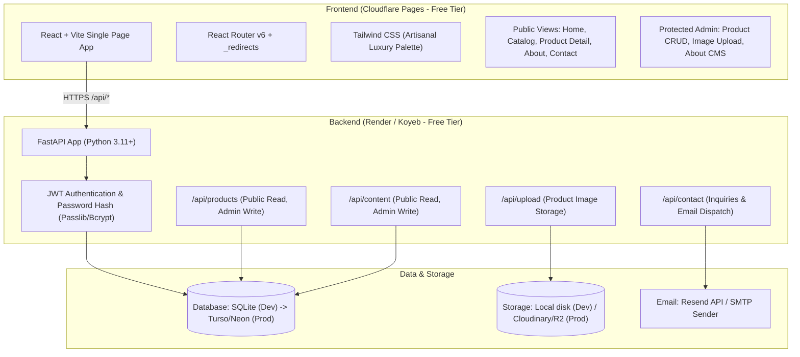

# Artisanal Tea Firm Website & Admin CMS: Implementation Plan & Progress Checklist

> **Project Reference**: Structurally and visually inspired by `pbai.in` (*Purple Bean Agro Industries*), adapted for an artisanal luxury tea brand (**Aura Artisanal Teas**).
> **Architecture**: FastAPI (Backend) + React / Vite / Tailwind CSS (Frontend) + SQLModel / SQLite / Turso / Neon (Database) + Cloudflare Pages (Frontend Hosting).

---

## Architecture Overview

---

## Technical Stack & Architectural Decisions

1. **Backend**: Python 3.14 + FastAPI + SQLModel (SQLAlchemy 2.0 + Pydantic v2).
2. **Frontend**: React 19 + Vite 6 + Tailwind CSS v4 + Lucide Icons.
3. **Database**: SQLModel connecting to local SQLite (`sqlite:///./tea_showcase.db`) for dev, with zero-code switch to Turso (`sqlite+libsql://...`) or Neon (`postgresql://...`) via `DATABASE_URL` for production (neither requires a credit card on their free tiers).
4. **Authentication**: Self-contained JWT tokens with bcrypt password hashing in FastAPI.
5. **Hosting**:
   - Frontend: Cloudflare Pages (free tier, global CDN, automated Git deploys, `public/_redirects` for SPA routing).
   - Backend: Render or Koyeb free tier.
6. **Inquiry / Contact Dispatch**: Sends email via Resend API or SMTP while also logging all submissions to the database.

---

## Master Implementation Checklist

### Milestone 1: Repository & Environment Initialization
- [x] Initialize Git repository in `/home/saket/Saket/Projects`
- [x] Check / Install Node.js & npm (v22 LTS installed via nvm) in local WSL environment
- [x] Setup base repository structure (`backend/`, `frontend/`, `docs/`)
- [x] Create root `.gitignore` and `README.md`

### Milestone 2: Backend Development (FastAPI + SQLModel)
- [x] Create Python virtual environment (`backend/venv`) & `backend/requirements.txt`
- [x] Install backend dependencies (`fastapi`, `sqlmodel`, `pydantic-settings`, `pyjwt`, `bcrypt`, `pytest`)
- [x] Implement `backend/app/core/config.py` with environment variable loading
- [x] Implement `backend/app/core/database.py` (SQLModel engine, session dependency)
- [x] Implement `backend/app/core/security.py` (password hashing, JWT creation & decoding)
- [x] Create database models in `backend/app/models/`:
  - [x] `product.py` (Product model, category, terroir, brewing guide, flavor notes)
  - [x] `content.py` (SiteContent for About page, Inquiry model for contact form)
  - [x] `admin.py` (AdminUser credentials model)
- [x] Build API endpoints in `backend/app/api/`:
  - [x] `auth.py` (`POST /api/auth/login`, `GET /api/auth/me`)
  - [x] `products.py` (Public list/detail, admin CRUD & reordering)
  - [x] `content.py` (Public read, admin update for About page)
  - [x] `contact.py` (Public inquiry intake, DB recording, email dispatch)
  - [x] `upload.py` (Image upload endpoint with static mount / cloud storage hook)
- [x] Assemble FastAPI entrypoint `backend/app/main.py` with CORS and static file mounting
- [x] Implement seed script `backend/app/seed.py` with authentic single-estate teas & admin user
- [x] Write backend automated tests in `backend/tests/test_api.py` and verify with `pytest`

### Milestone 3: Frontend Development (React + Vite + Tailwind CSS)
- [x] Initialize Vite React project in `frontend/`
- [x] Install frontend dependencies (`react-router-dom`, `lucide-react`, `tailwindcss`, `@tailwindcss/vite`)
- [x] Configure `index.css` and `@theme` with the artisanal luxury palette (jade, cream, amber, brass)
- [x] Add `public/_redirects` for Cloudflare Pages SPA client-side routing
- [x] Implement API client `frontend/src/services/api.js`
- [x] Implement Authentication Context `frontend/src/context/AuthContext.jsx`
- [x] Build Layout Components:
  - [x] `Navbar.jsx` (Sticky brand header, navigation links, mobile drawer, catalog CTA)
  - [x] `Footer.jsx` (Corporate summary, categories, factory/estate contact, quick links)
- [x] Build Public Pages:
  - [x] `HomePage.jsx` (Hero with luxury typography, Terroir cards, Featured teas, Inquiry CTA)
  - [x] `CatalogPage.jsx` (Category filter pills, tasting notes search, 3-column card grid)
  - [x] `ProductDetailPage.jsx` (High-res imagery, botanical specs, Interactive Brewing Guide Matrix, tasting notes tags)
  - [x] `InquiryModal.jsx` (Pre-populated sample request / wholesale inquiry modal)
  - [x] `AboutPage.jsx` (Dynamic heritage story, sourcing philosophy, ethical standards)
  - [x] `ContactPage.jsx` (Corporate contact info, interactive lead generation form)
- [x] Build Admin CMS Pages:
  - [x] `AdminLogin.jsx` (Protected admin login screen)
  - [x] `AdminDashboard.jsx` (Product table, drag/order editor, featured toggle, quick actions)
  - [x] `ProductEditor.jsx` (Create & edit tea products, image upload, brewing guide builder)
  - [x] `ContentEditor.jsx` (Edit About page narrative & contact details without redeploying)

### Milestone 4: End-to-End Verification & Production Readiness
- [x] Verify backend test suite passes (`pytest -v`, 5/5 tests passing)
- [x] Verify frontend production build succeeds (`npm run build`, clean bundle in `dist/`)
- [x] Test complete user flow: Home $\rightarrow$ Catalog $\rightarrow$ Product Detail $\rightarrow$ Brewing Guide $\rightarrow$ Submit Inquiry
- [x] Test complete admin flow: Login $\rightarrow$ Create Product with Image $\rightarrow$ Reorder $\rightarrow$ Update About Page $\rightarrow$ Verify changes on public site
- [x] Finalize documentation and update progress status in `docs/implementation_plan.md`
