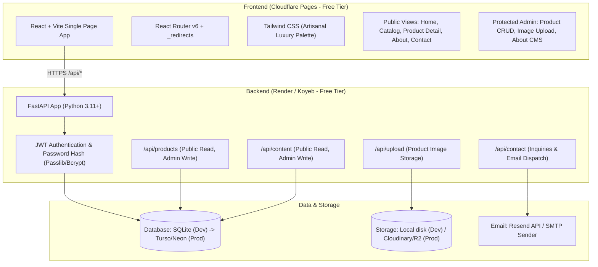

# Implementation Plan: Artisanal Tea Firm Product Showcase & Admin CMS

A high-performance, responsive product showcase website and lightweight Content Management System (CMS) for an artisanal tea firm, structurally and visually inspired by **pbai.in** (*Purple Bean Agro Industries*) with an original luxury botanical aesthetic.

---

## User Review Required

> [!IMPORTANT]
> **Node.js Environment Prerequisite**:
> Verification of your local WSL environment revealed that **Python 3.14** and **Git 2.53** are installed, but **Node.js and npm are currently missing**.
> To build the React frontend, we will install Node.js (recommended via NodeSource LTS) in the local setup phase.

> [!NOTE]
> **Zero-Cost Database Strategy (Turso / Neon / SQLite)**:
> We will configure the backend using **SQLModel** (SQLAlchemy + Pydantic).
> By default, it will run locally on **SQLite** (`sqlite:///./tea_showcase.db`) with zero setup.
> When deploying, you can switch seamlessly to **Turso** (`sqlite+libsql://...`) or **Neon** (`postgresql://...`) simply by setting the `DATABASE_URL` environment variable. Neither service requires credit card details for their free tier accounts.

---

## Architecture Overview



---

## Master Implementation Checklist

> **Resumable Progress**: Every task in this checklist can be tracked across sessions. As each item is completed, mark it `[x]`.

### Milestone 1: Repository & Environment Initialization
- [ ] Initialize Git repository in `/home/saket/Saket/Projects`
- [ ] Install Node.js & npm (v20 LTS via NodeSource) in local WSL environment
- [ ] Create directory structure (`backend/`, `frontend/`, `docs/`)
- [ ] Save full implementation plan into `docs/implementation_plan.md` in repository
- [ ] Add `.gitignore` and base `README.md`

### Milestone 2: Backend Development (FastAPI + SQLModel)
- [ ] Create Python virtual environment (`backend/venv`) & `backend/requirements.txt`
- [ ] Install backend dependencies
- [ ] Implement `backend/app/core/config.py` with environment variable loading
- [ ] Implement `backend/app/core/database.py` (SQLModel engine, session dependency)
- [ ] Implement `backend/app/core/security.py` (password hashing, JWT creation & decoding)
- [ ] Create database models in `backend/app/models/`:
  - [ ] `product.py` (Product model, category, terroir, brewing guide, flavor notes)
  - [ ] `content.py` (SiteContent for About page, Inquiry model for contact form)
  - [ ] `admin.py` (AdminUser credentials model)
- [ ] Build API endpoints in `backend/app/api/`:
  - [ ] `auth.py` (`POST /api/auth/login`, `GET /api/auth/me`)
  - [ ] `products.py` (Public list/detail, admin CRUD & reordering)
  - [ ] `content.py` (Public read, admin update for About page)
  - [ ] `contact.py` (Public inquiry intake, DB recording, email dispatch)
  - [ ] `upload.py` (Image upload endpoint with static mount / cloud storage hook)
- [ ] Assemble FastAPI entrypoint `backend/app/main.py` with CORS and static file mounting
- [ ] Implement seed script `backend/app/seed.py` with authentic single-estate teas & admin user
- [ ] Write backend automated tests in `backend/tests/test_api.py` and verify with `pytest`

### Milestone 3: Frontend Development (React + Vite + Tailwind CSS)
- [ ] Initialize Vite React project in `frontend/`
- [ ] Install frontend dependencies (`react-router-dom`, `lucide-react`, `tailwindcss`, `postcss`, `autoprefixer`)
- [ ] Configure `tailwind.config.js` with the artisanal luxury palette (jade, cream, amber, brass)
- [ ] Add `public/_redirects` for Cloudflare Pages SPA client-side routing
- [ ] Implement API client `frontend/src/services/api.js`
- [ ] Implement Authentication Context `frontend/src/context/AuthContext.jsx`
- [ ] Build Layout Components:
  - [ ] `Navbar.jsx` (Sticky brand header, navigation links, mobile drawer, catalog CTA)
  - [ ] `Footer.jsx` (Corporate summary, categories, factory/estate contact, quick links)
- [ ] Build Public Pages:
  - [ ] `HomePage.jsx` (Hero with luxury typography, Terroir cards, Featured teas, Inquiry CTA)
  - [ ] `CatalogPage.jsx` (Category filter pills, tasting notes search, 3-column card grid)
  - [ ] `ProductDetailPage.jsx` (High-res imagery, botanical specs, Interactive Brewing Guide Matrix, tasting notes tags)
  - [ ] `InquiryModal.jsx` (Pre-populated sample request / wholesale inquiry modal)
  - [ ] `AboutPage.jsx` (Dynamic heritage story, sourcing philosophy, ethical standards)
  - [ ] `ContactPage.jsx` (Corporate contact info, interactive lead generation form)
- [ ] Build Admin CMS Pages:
  - [ ] `AdminLogin.jsx` (Protected admin login screen)
  - [ ] `AdminDashboard.jsx` (Product table, drag/order editor, featured toggle, quick actions)
  - [ ] `ProductEditor.jsx` (Create & edit tea products, image upload, brewing guide builder)
  - [ ] `ContentEditor.jsx` (Edit About page narrative & contact details without redeploying)

### Milestone 4: End-to-End Verification & Production Readiness
- [ ] Verify backend test suite passes (`pytest`)
- [ ] Verify frontend production build succeeds (`npm run build`)
- [ ] Test complete user flow: Home $\rightarrow$ Catalog $\rightarrow$ Product Detail $\rightarrow$ Brewing Guide $\rightarrow$ Submit Inquiry
- [ ] Test complete admin flow: Login $\rightarrow$ Create Product with Image $\rightarrow$ Reorder $\rightarrow$ Update About Page $\rightarrow$ Verify changes on public site
- [ ] Finalize documentation and update progress status in `docs/implementation_plan.md`

---

## Proposed File Changes Detail

```text
/home/saket/Saket/Projects/
├── backend/                  # FastAPI Application
│   ├── app/
│   │   ├── api/              # API Route Handlers
│   │   ├── core/             # Config, DB Session, Security
│   │   ├── models/           # SQLModel Schemas (DB + Pydantic)
│   │   ├── main.py           # FastAPI Entrypoint & CORS
│   │   └── seed.py           # Initial Database Seed Script
│   ├── tests/                # Automated API Tests
│   ├── requirements.txt
│   └── .env.example
├── frontend/                 # React + Vite Application
│   ├── public/
│   │   └── _redirects        # Cloudflare Pages SPA Routing
│   ├── src/
│   │   ├── components/       # Nav, Footer, Hero, Cards, BrewingGuide
│   │   ├── context/          # AuthContext (JWT State)
│   │   ├── pages/            # Public & Admin Pages
│   │   ├── services/         # Axios/Fetch API Client
│   │   ├── App.jsx
│   │   └── main.jsx
│   ├── package.json
│   ├── tailwind.config.js
│   └── vite.config.js
├── docs/
│   └── implementation_plan.md# Master Plan & Resumable Checklist
├── .gitignore
└── README.md
```

### Backend Component (`backend/`)

#### [NEW] `backend/requirements.txt`
```text
fastapi>=0.115.0
uvicorn[standard]>=0.30.0
sqlmodel>=0.0.22
pydantic-settings>=2.5.0
python-jose[cryptography]>=3.3.0
passlib[bcrypt]>=1.7.4
python-multipart>=0.0.12
httpx>=0.27.0
resend>=2.4.0
pytest>=8.3.0
```

#### [NEW] `backend/app/core/config.py`
Application configuration loaded from environment variables using `pydantic-settings`:
- `DATABASE_URL`: Defaults to `sqlite:///./tea_showcase.db`
- `SECRET_KEY`: JWT signing secret
- `ACCESS_TOKEN_EXPIRE_MINUTES`: 1440 (24 hours)
- `ADMIN_USERNAME` & `ADMIN_INITIAL_PASSWORD`: Bootstrapped superuser credentials
- `RESEND_API_KEY` & `INQUIRY_RECEIVER_EMAIL`: Contact form dispatch
- `CORS_ORIGINS`: Allowed origins (e.g. `http://localhost:5173`, Cloudflare Pages domain)

#### [NEW] `backend/app/models/product.py`
Sensible, lean data model tailored for high-end tea products:
```python
from typing import Optional, List
from sqlmodel import SQLModel, Field, Column, JSON

class ProductBase(SQLModel):
    name: str
    slug: str = Field(unique=True, index=True)
    category: str = Field(index=True) # Black, Green, White, Oolong, Tisane
    origin: str # e.g. "Darjeeling, West Bengal (5,200 ft)"
    flush: Optional[str] = None # "First Flush 2026", "Spring Harvest"
    grade: Optional[str] = None # "FTGFOP1", "Hand-Rolled Pearls"
    short_description: str
    description: str
    flavor_notes: List[str] = Field(default=[], sa_column=Column(JSON))
    brewing_guide: dict = Field(
        default={
            "temp": "85°C / 185°F",
            "steep_time": "3 mins",
            "ratio": "2.5g per 200ml",
            "infusions": 3
        },
        sa_column=Column(JSON)
    )
    image_url: str
    is_featured: bool = False
    display_order: int = 0
    is_available: bool = True

class Product(ProductBase, table=True):
    id: Optional[int] = Field(default=None, primary_key=True)

class ProductCreate(ProductBase):
    pass

class ProductUpdate(SQLModel):
    name: Optional[str] = None
    slug: Optional[str] = None
    category: Optional[str] = None
    origin: Optional[str] = None
    flush: Optional[str] = None
    grade: Optional[str] = None
    short_description: Optional[str] = None
    description: Optional[str] = None
    flavor_notes: Optional[List[str]] = None
    brewing_guide: Optional[dict] = None
    image_url: Optional[str] = None
    is_featured: Optional[bool] = None
    display_order: Optional[int] = None
    is_available: Optional[bool] = None
```

#### [NEW] `backend/app/models/content.py`
Storage for editable site content:
- **`SiteContent`**: Stores the editable About Us page story, terroir philosophy, sourcing ethics, and corporate contact info.
- **`Inquiry`**: Stores submitted customer inquiries and wholesale sample requests.

#### [NEW] `backend/app/api/auth.py`
- `POST /api/auth/login`: Accepts form credentials, validates against bcrypt hash, returns `{ "access_token": token, "token_type": "bearer" }`.
- `GET /api/auth/me`: Verifies active session token.

#### [NEW] `backend/app/api/products.py`
- `GET /api/products`: Public endpoint with filtering by `category`, search query, and sorting by `display_order`.
- `GET /api/products/{slug}`: Public endpoint returning full product details and brewing matrix.
- `POST /api/products`: Protected endpoint (admin only) creating a new product.
- `PUT /api/products/{id}`: Protected endpoint (admin only) updating a product.
- `DELETE /api/products/{id}`: Protected endpoint (admin only) deleting a product.

#### [NEW] `backend/app/api/content.py`
- `GET /api/content/about`: Public endpoint fetching About page content.
- `PUT /api/content/about`: Protected endpoint (admin only) updating About page content.

#### [NEW] `backend/app/api/contact.py`
- `POST /api/contact`: Public endpoint receiving wholesale/retail inquiries:
  - Validates contact details & inquiry message
  - Records inquiry in the database
  - Sends immediate email notification via Resend/SMTP to company email

#### [NEW] `backend/app/api/upload.py`
- `POST /api/upload`: Handles multipart image uploads. Saves to `uploads/` directory locally with static file mounting, with simple adapter for Cloudinary or Cloudflare R2 in production.

#### [NEW] `backend/app/seed.py`
Initial population script providing authentic sample tea products (Single-Estate Darjeeling, Nilgiri Frost, Assam Orthodox Gold, Kashmiri Kahwa Green) and default About page narrative.

---

### Frontend Component (`frontend/`)

#### [NEW] `frontend/tailwind.config.js`
Artisanal botanical luxury color palette:
```javascript
export default {
  content: ["./index.html", "./src/**/*.{js,jsx}"],
  theme: {
    extend: {
      colors: {
        tea: {
          50: '#FAF8F5',   // Warm handmade paper cream (bg-primary)
          100: '#F3EFEA',  // Soft sand / muted divider
          200: '#E4DDD3',  // Border tone
          700: '#2A4A38',  // Rich garden green
          800: '#183526',  // Deep jade / mountain leaf (primary brand)
          900: '#0E2117',  // Deepest forest black
        },
        amber: {
          500: '#C58F58',  // Liquor amber / warm roast
          600: '#A9713C',  // Rich golden brew
        },
        brass: {
          400: '#D4AF37',  // Estate seal / gold foil accent
        }
      },
      fontFamily: {
        serif: ['"Playfair Display"', 'Georgia', 'serif'],
        sans: ['Inter', 'system-ui', 'sans-serif'],
      }
    },
  },
  plugins: [],
}
```

#### [NEW] `frontend/public/_redirects`
Configures Cloudflare Pages to redirect all route paths to `index.html` with status 200, guaranteeing clean SPA URLs without 404 errors:
```text
/*    /index.html   200
```

---

## Local Development Setup

### 1. Prerequisites (WSL)
```bash
# Install Node.js (v20 LTS recommended via NodeSource or nvm)
curl -fsSL https://deb.nodesource.com/setup_20.x | sudo -E bash -
sudo apt install -y nodejs
```

### 2. Backend Setup
```bash
cd /home/saket/Saket/Projects/backend
python3 -m venv venv
source venv/bin/activate
pip install -r requirements.txt
cp .env.example .env
python app/seed.py      # Seeds default products and initial admin user
uvicorn app.main:app --reload --port 8000
```

### 3. Frontend Setup
```bash
cd /home/saket/Saket/Projects/frontend
npm install
npm run dev             # Starts Vite dev server on http://localhost:5173
```

---

## Deployment Strategy (Zero-Cost Architecture)

1. **Frontend (Cloudflare Pages)**:
   - Connect Git repository to Cloudflare Pages.
   - Build command: `cd frontend && npm run build`
   - Build output directory: `frontend/dist`
   - Automatic SSL, custom domain, global CDN caching.
2. **Backend (Render / Koyeb Free Tier)**:
   - Connect Git repository (root directory: `backend`).
   - Start command: `uvicorn app.main:app --host 0.0.0.0 --port $PORT`
   - Set environment variables (`DATABASE_URL`, `SECRET_KEY`, `CORS_ORIGINS`).
3. **Database (Turso or Neon)**:
   - Create a free database on Turso or Neon (no credit card required).
   - Paste connection string into backend `DATABASE_URL`.
